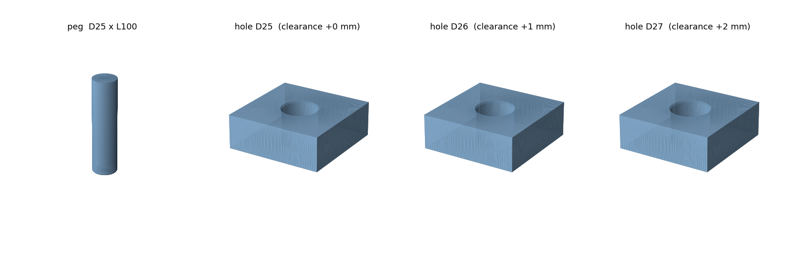

# peg-in-hole 시험용 peg / hole 블록

peg(핀) 하나와, 구멍 지름만 다른 블록 3개. 단위는 **mm**(STL 자체에는 단위 정보가
없어서, 슬라이서나 시뮬레이터에서 "1 = 1 mm"로 읽히도록 만들었다).



| 파일 | 내용 | 외형 치수 |
|---|---|---|
| `peg_d25.0_l100.stl` | 지름 25.0, 길이 100.0 원기둥. 삽입되는 끝에 45° 모따기 1 mm | 25 × 25 × 100 |
| `hole_d25.0.stl` | 관통 구멍 지름 25.0 (틈 0.0) | 70 × 70 × 25 |
| `hole_d26.0.stl` | 관통 구멍 지름 26.0 (틈 1.0) | 70 × 70 × 25 |
| `hole_d27.0.stl` | 관통 구멍 지름 27.0 (틈 2.0) | 70 × 70 × 25 |

여기서 **틈(clearance)** 은 `구멍 지름 − peg 지름`이다. 반지름 차이가 아니라
지름 차이이므로, 한쪽으로 몰렸을 때 실제로 남는 여유는 그 절반이다.
예: 26.0 구멍이면 peg가 중심에서 최대 0.5 mm까지 벗어나도 들어간다.

## 형상 규격

- **peg**: 전체 길이 100, 지름 25 그대로. 끝(z = 0)의 45° 모따기 1 mm는 정격
  치수 **안쪽**으로만 깎으므로 외형 치수는 변하지 않는다. 반대쪽(z = 100)은
  평면이라 그리퍼로 잡거나 플랜지를 붙이기 쉽다.
- **hole 블록**: 70 × 70 × 25. 구멍은 위아래로 완전히 관통한다.
  윗면 입구에만 45° 모따기 1 mm가 있고, **그 아래 24 mm는 정확히 정격 지름의
  직선 구멍**이다. 즉 실제 끼워맞춤 난이도를 결정하는 구간은 손대지 않았다.
  입구 모따기가 없는 순수 직선 구멍이 필요하면 `--entry-chamfer 0`.
- 원은 256각형으로 근사했다. 근사 오차(약 0.001 mm)가 끼워맞춤을 **더 빡빡하게**
  만드는 쪽으로는 가지 않도록 방향을 정했다.
  - peg: 꼭짓점을 정격 원 위에 둔다(내접) → 실제 지름 ≤ 25.000
  - hole: 변이 정격 원에 닿게 둔다(외접) → 실제 구멍 ≥ 정격 지름
- 네 부품 모두 watertight(구멍 없는 닫힌 표면)이고 법선이 바깥을 향한다.
  블록의 오일러 수는 0 = 관통 구멍 1개인 도넛 위상으로, 의도한 형상이 맞다.

## 출력할 때 주의

- **틈 0.0(`hole_d25.0`)은 3D 프린터로는 사실상 안 들어간다.** FDM은 보통
  구멍이 0.2~0.4 mm 작게, 기둥이 0.1~0.2 mm 크게 나온다. 이 파일은 "치수상
  틈 0"이라는 기준점 용도이고, 실제로 넣어보려면 출력물을 실측한 뒤
  리머·드릴로 다듬거나 `--holes` 로 값을 다시 만드는 게 맞다.
- 블록은 구멍 축이 Z와 나란하므로 그대로(윗면이 위) 놓고 서포트 없이 출력된다.
  peg는 세워서 출력하면 층 사이가 약해 삽입 중 휘기 쉽다. 누워서 출력하면
  단면이 타원으로 찌그러지기 쉬우니, 세로 출력 + 벽 두께를 늘리는 쪽을 권한다.
- 실제 틈은 출력 후 실측해서 기록하는 게 좋다. 캘리퍼로 peg 지름(3군데)과
  구멍 지름(입구·중간)을 재면 명목값이 아닌 실제 난이도를 알 수 있다.

## 다시 만들기 / 치수 바꾸기

```bash
python3 peg_in_hole.py --preview                       # 기본값으로 재생성
python3 peg_in_hole.py --holes 25.3 25.5 26.0          # 구멍 지름 바꾸기
python3 peg_in_hole.py --peg-diameter 20 --peg-length 80
python3 peg_in_hole.py --thickness 40 --entry-chamfer 0  # 더 깊고 입구 모따기 없음
```

의존성은 `numpy`, `trimesh`(+ `--preview` 에만 `matplotlib`)뿐이다.
boolean 연산(`manifold3d`)이나 `shapely` 없이 삼각형을 직접 쌓아 만든다.
